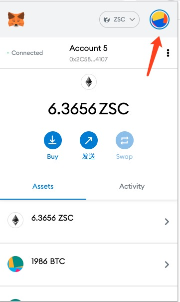
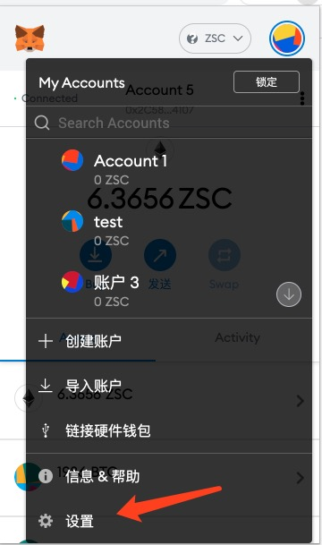
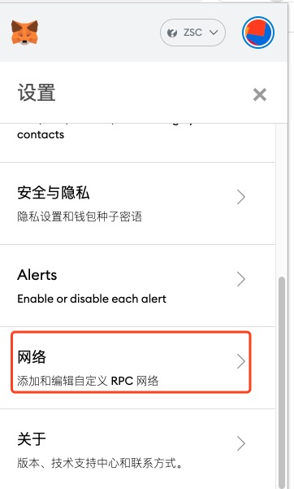
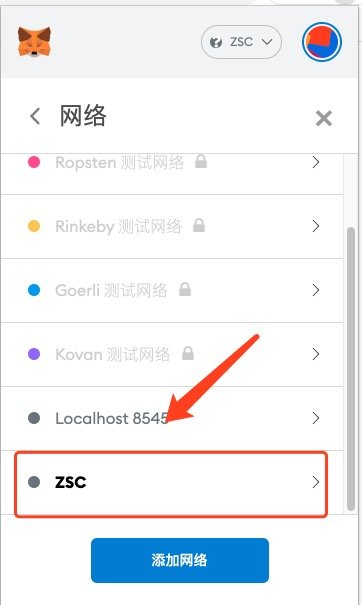
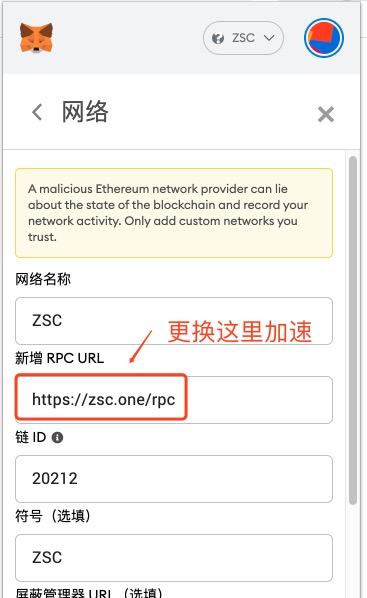

# 挖矿交易加速[图文]
文档描述通过切换小狐狸钱包（metamask）网络节点的方式来进行进行挖矿交易加速的方法。

用户可以根据自己所处的地域来选取不同的挖矿服务器。

步骤为：

```
账号头=->设置->网络->zsc 网络配置

更换RPC节点地址为：https://zsc.one/rpc


```

# 加速方法

## 第一步 点击账号



## 第二步 点击设置




## 第三步 点击网络



## 第四步 找到你配置的 Zsc 网络



## 第一步 更换节点地址

> 加速密码

https://zsc.one/rpc

