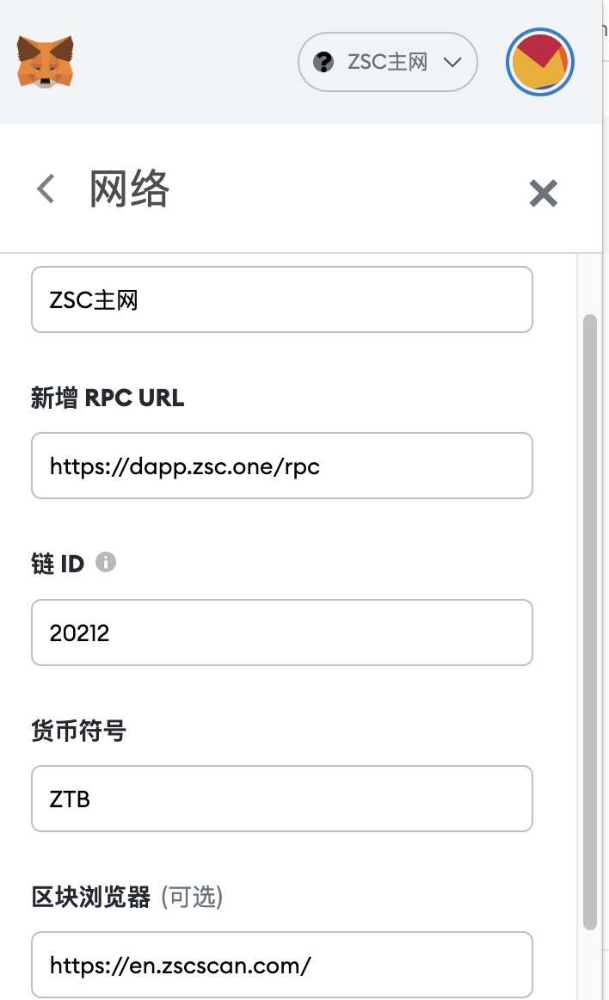

# 概况

`ZSC` 支持 `metamask` 浏览器插件、`jianbao app`.

> 注意：提现到钱包之前，请检查兼容性，已知 `Ledger` 暂未支持

# metamask

下载地址：https://metamask.io/

添加自定义网络：

## 主网

```
chainid: 20212
rpc: https://zsc.one/rpc
scan:  http://zenithsmartchain.com/
```




## 测试网

```
> 待更新

```


# jianbao wallet app

https://www.sipc.vip/

# ZSC wallet extension

> 待公布

# Zsc cointtype

https://github.com/satoshilabs/slips/blob/master/slip-0044.md