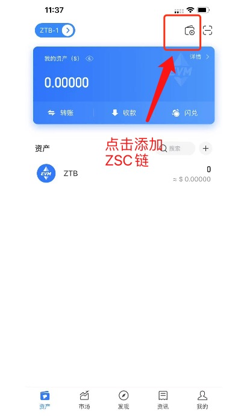
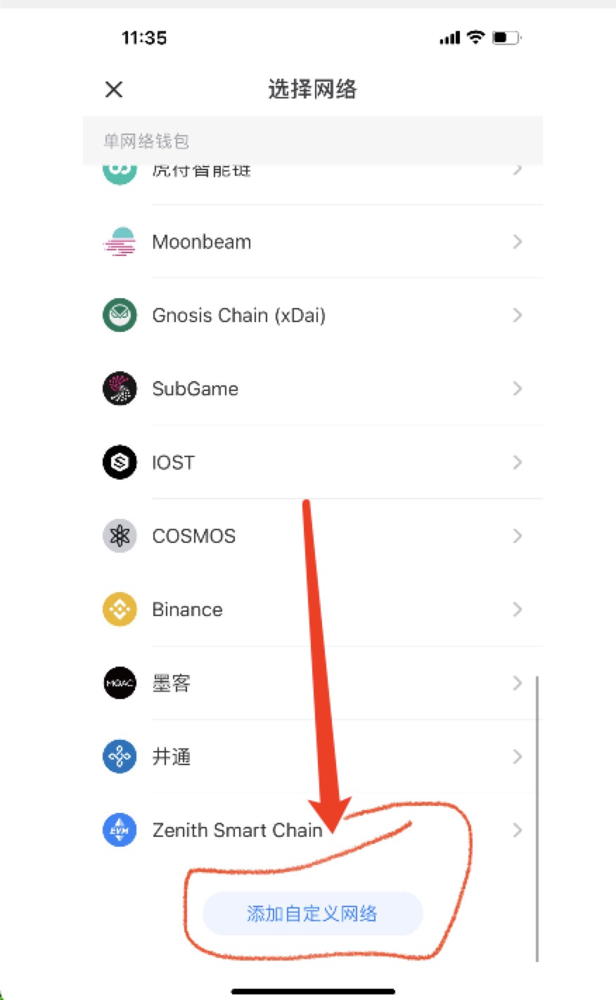
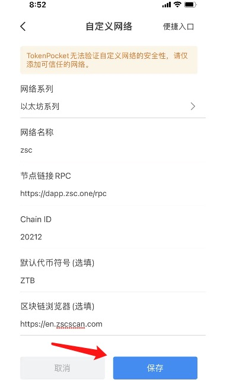

# 概况

`ZSC` 支持 `metamask` 浏览器插件、`jianbao app`.

> 注意：提现到钱包之前，请检查兼容性，已知 `Ledger` 暂未支持

# metamask

下载地址：https://metamask.io/

添加自定义网络：

```
chainid: 20212
rpc: https://dapp.zsc.one/rpc
scan:  https://en.zscscan.com/
```


# TokenPocket

1. 下载管理：https://www.tokenpocket.pro

2. 添加ZSC网络：

```
chainid: 20212
rpc: https://dapp.zsc.one/rpc
scan:  https://en.zscscan.com/
```

点击添加ZSC链



添加自定义网络



添加完成，进行保存




# BitKeep

下载地址： https://bitkeep.com/

